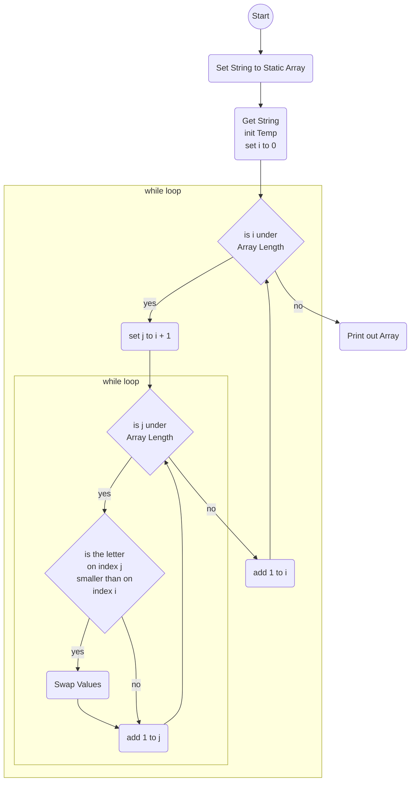

# Modul-319-A3-Series-A

```mermaid
    flowchart TD
    A((Start))-->B(Set String to Static Array)
    B-->C(Get String\ninit Temp\nset i to 0)
    C-->D{is i under\nArray Length}
    D-->|no|E(Print out Array)
    subgraph while loop
    G-->|no|H(add 1 to i)
    F-->G{is j under\nArray Length}
    H-->D
    subgraph while loop
    G-->|yes|I{is the letter\non index j\nsmaller than on\nindex i}
    I-->|yes|K(Swap Values)
    K-->J
    I-->|no|J(add 1 to j)
    end
    J-->G
    D-->|yes|F(set j to i + 1)
    end
```
